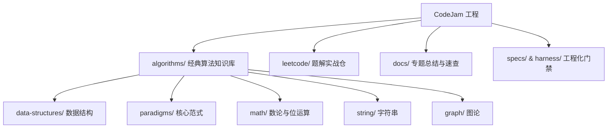

# 我的算法与数据结构实战库 (CodeJam)

本仓库用于系统化记录**算法与数据结构核心知识库**、**LeetCode 刷题题解**与**工程化测试验证**。

---

## 📌 内容架构与索引



### 1. 经典算法知识库 ([纲要](https://qtopie.github.io/notes/codejam/classic-algorithms/))

按计算机科学体系组织的基础算法、数据结构模板与理论沉淀：

| 模块目录 | 涵盖主题 | 包含实现/文档 |
| :--- | :--- | :--- |
| [`algorithms/core-concepts/`](algorithms/core-concepts/) | 核心概念 | 复杂度分析、主定理、递归与递推、正确性证明 |
| [`algorithms/data-structures/`](algorithms/data-structures/) | 核心数据结构 | 数组、单链表反转/删除、最小堆/优先队列、栈、二叉树/B树、跳表与线段树 |
| [`algorithms/paradigms/`](algorithms/paradigms/) | 算法范式 | 分治（归并/快排/二分）、动态规划（背包/LCS）、回溯（N皇后/电话按键）、滑动窗口、前缀和/差分数组、单调栈、排序 |
| [`algorithms/string/`](algorithms/string/) | 字符串 | 编辑距离、字符串移位旋转包含、空格替换、KMP、Trie、后缀结构 |
| [`algorithms/math/`](algorithms/math/) | 数论与位运算 | 常用位操作（Get/Set/Clear/Toggle）、Hamming 权重（1的个数）、数论与计算几何 |
| [`algorithms/graph/`](algorithms/graph/) | 图论 | 遍历、最短路（Dijkstra/Floyd）、MST、拓扑排序、网络流 |
| [`algorithms/dp-optimization/`](algorithms/dp-optimization/) | DP 进阶优化 | 单调队列优化、斜率优化、四边形不等式 |

### 2. LeetCode 题目实战

按题目编号与专题组织的实战题解：

| 目录 | 说明 |
| :--- | :--- |
| [`leetcode/`](leetcode/) | LeetCode 高频与经典题解实现（涵盖数组、链表、树、DP、回溯等专题） |

### 3. 专题总结与语言速查文档

| 分类 | 文档链接 | 描述 |
| :--- | :--- | :--- |
| **专题总结** | [`docs/tree.md`](docs/tree.md) | **二叉树与搜索树核心解题方法论**（分治汇总、前序上下文、BST中序单调、树构造、BFS） |
| **专题总结** | [`docs/linked-list.md`](docs/linked-list.md) | 链表核心题型与技巧总结（双指针、反转、虚拟头节点、LRU） |
| **专题总结** | [`docs/binary-search.md`](docs/binary-search.md) | LeetCode 前 200 题二分查找题单与边界模板 |
| **语言速查** | [`docs/references/java-cheatsheet.md`](docs/references/java-cheatsheet.md) | **Java 刷题语法与常用 API 极速速查表**（基础类型、数组/字符串、集合/堆栈/队列、位运算与状压、排序、避坑清单） |
| **语言规范** | [`docs/references/code-conventions.md`](docs/references/code-conventions.md) | Go 编码规范与错误处理准则 |
| **工程成长** | [`docs/be-a-good-engineer.md`](docs/be-a-good-engineer.md) | 软件工程师能力模型（Mindmap）与面试准备路线 |
| **系统设计** | [`docs/system-design.md`](docs/system-design.md) | 系统设计思考与方法论 |
| **架构规范** | [`docs/project-layout.md`](docs/project-layout.md) | 项目结构规范与模块依赖准则 |
| **测试指南** | [`docs/testing/`](docs/testing/) | 测试规范与 Harness 测试工程体系指南 |

---

## 🛠️ 工程化测试与校验

本工程采用 **Spec-First** 与 **Harness-Driven Development** 体系保障代码质量与规范一致性：

| 目录/工具 | 说明 |
| :--- | :--- |
| [`AGENTS.md`](AGENTS.md) | 协作与工程红线控制总则 |
| `specs/` | Single Source of Truth (SSOT) 规范契约 |
| `harness/` | 评估沙盒、测试夹具（Fixtures）与 Mock 桩服务 |
| [`scripts/check.sh`](scripts/check.sh) | 一键执行代码 Lint、Harness 沙盒与 Spec 一致性校验 |

### 快速运行校验

```bash
# 1. 运行全局 Harness 评估与一致性校验门禁
./scripts/check.sh

# 2. 运行 algorithms 模块全部单元测试
go test -v ./algorithms/...
```
