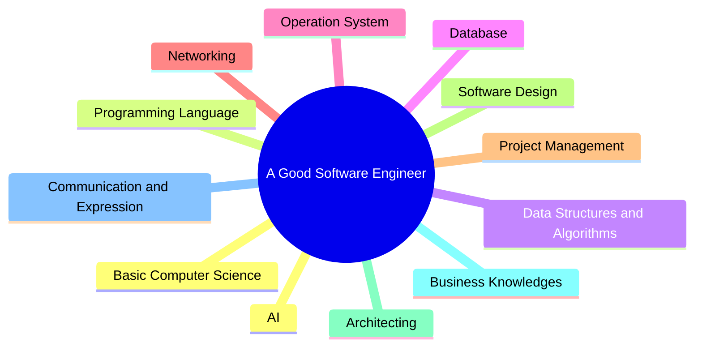
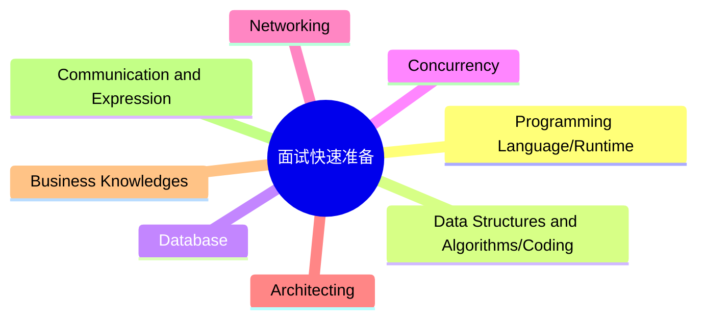

# Be a good engineer

## Coding

LeetCode

https://leetcode.cn/studyplan/top-interview-150/

Data Structures & Algorithms

Redis Data Structures

## Redis

## MySQL

```mermaid
mindmap
  root((A Good Software Engineer))
    Basic Computer Science
    Programming Language
    Data Structures and Algorithms
    Database
    Operation System
    Networking
    Project Management
    Software Design
    Architecting
    Business Knowledges
    Communication and Expression
    AI
```

```mermaid
mindmap
  root((面试快速准备))
    Programming Language/Runtime
    Data Structures and Algorithms/Coding
    Database
    Concurrency
    Networking
    Architecting
    Business Knowledges
    Communication and Expression
```
