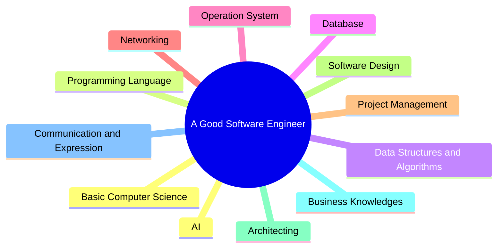
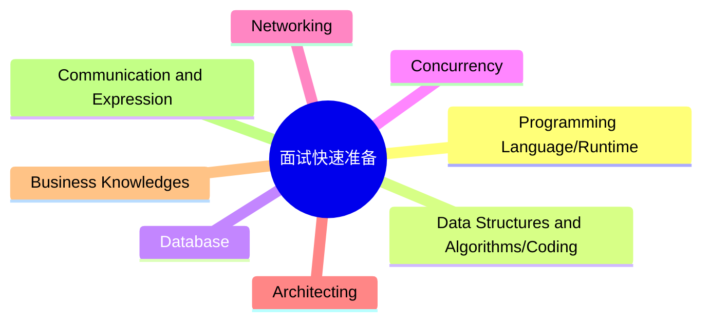

# Be a Good Engineer

## 核心能力与知识体系

## 面试准备脉络

## 学习资源与题单
- **LeetCode 经典 150 题**: [Top Interview 150](https://leetcode.cn/studyplan/top-interview-150/)
- **数据结构与算法**: 本工程 [`algorithms/`](../algorithms/) 与 [`leetcode/`](../leetcode/)
- **基础设施与存储**: Redis 常用数据结构、MySQL 索引与事务优化
