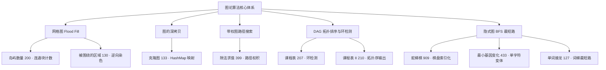

# Graph — 图论核心解题方法论

> 本文档将 LeetCode 高频图论题目（Top 200 图题 + Graph BFS 专题）按**核心解题思维、遍历模式与算法知识点**进行深度浓缩与归纳。图论题看似题型繁杂，但刷题层面无非五种思维范式：**网格 Flood Fill、图的深拷贝、带权路径搜索、拓扑排序 / 环检测、隐式图 BFS**。

---

## 目录
1. [知识点全景图与考点矩阵](#1-知识点全景图与考点矩阵)
2. [思维范式一：网格图 Flood Fill（连通分量与染色）](#2-思维范式一网格图-flood-fill连通分量与染色)
3. [思维范式二：图的深拷贝（节点映射记忆化）](#3-思维范式二图的深拷贝节点映射记忆化)
4. [思维范式三：带权图的路径搜索](#4-思维范式三带权图的路径搜索)
5. [思维范式四：有向无环图与拓扑排序（DAG + 环检测）](#5-思维范式四有向无环图与拓扑排序dag--环检测)
6. [思维范式五：隐式图 BFS（状态空间最短路径）](#6-思维范式五隐式图-bfs状态空间最短路径)
7. [高频避坑与边界清单 (Gotchas)](#7-高频避坑与边界清单-gotchas)

---

## 1. 知识点全景图与考点矩阵



### 核心考点与经典题目对照

| 知识范式 | 核心思想 | 经典题目来源 |
| :--- | :--- | :--- |
| **网格 Flood Fill** | 从陆地出发连通染色，连通块计数（DFS/BFS 均可） | 岛屿数量 (200) |
| **边界逆向 Flood Fill** | 从边界出发标记「安全区」，其余全部翻转（正难则反） | 被围绕的区域 (130) |
| **深拷贝映射** | `map[旧节点]新节点` 记忆化遍历，避免重复创建 | 克隆图 (133) |
| **带权路径搜索** | 边带权重，路径答案 = 路径边权乘积（BFS/DFS） | 除法求值 (399) |
| **拓扑排序 / 环检测** | Kahn 入度削减 or DFS 三色标记，判断 DAG 并求拓扑序 | 课程表 (207)、课程表 II (210) |
| **隐式图 BFS** | 状态抽象为节点，「变换一步」即一条边，BFS 求最短变换次数 | 蛇梯棋 (909)、最小基因变化 (433)、单词接龙 (127) |

---

## 2. 思维范式一：网格图 Flood Fill（连通分量与染色）

### 核心心智模型
- **特征**：二维网格（`'1'/'0'`、`'O'/'X'` 等）中寻找连通块 / 满足条件的区域。
- **三件套**：二维方向数组、越界检查、就地染色（把访问过的格子改成占位符，省去 `visited` 数组）。
- **模板结构**：
  ```text
  1. 外层双重循环扫描每个格子。
  2. 遇到「未访问且满足条件」的格子 → 计数 / 记录 + 启动 Flood Fill。
  3. Flood Fill：DFS 递归 / 迭代栈 / BFS 队列，向四个方向扩散，顺手染色。
  ```

### 1. 连通块计数（岛屿数量 - 200）
- 每发现一个 `'1'` 就 `count++`，然后把整块相连的陆地染成 `'0'`，保证后续不会再被计入。
- **注意**：在入栈/入队时就立即染色，而不是出栈/出队时才染色，否则同一块会被重复处理。
- **复杂度**：时间 $O(m \times n)$，每个格子最多被访问常数次；原地染色空间 $O(1)$（递归栈最坏 $O(m \times n)$）。

```go
func numIslands(grid [][]byte) int {
    m, n := len(grid), len(grid[0])
    count := 0
    dirs := [][2]int{{-1, 0}, {1, 0}, {0, -1}, {0, 1}}
    for i := 0; i < m; i++ {
        for j := 0; j < n; j++ {
            if grid[i][j] != '1' {
                continue
            }
            count++
            // 迭代 DFS：用一维索引 idx = r*n + c 压栈，省去自建结构体
            stack := []int{i*n + j}
            grid[i][j] = '0'
            for len(stack) > 0 {
                idx := stack[len(stack)-1]
                stack = stack[:len(stack)-1]
                r, c := idx/n, idx%n
                for _, d := range dirs {
                    nr, nc := r+d[0], c+d[1]
                    if nr >= 0 && nr < m && nc >= 0 && nc < n && grid[nr][nc] == '1' {
                        grid[nr][nc] = '0' // 入栈即染色，防止重复
                        stack = append(stack, nr*n+nc)
                    }
                }
            }
        }
    }
    return count
}
```

### 2. 边界逆向 Flood Fill（被围绕的区域 - 130）
- **关键洞察**：直接找「被 X 包围的 O」很麻烦；反过来想——**与边界相连的 O 一定不会被包围**。
- **三步法**：
  1. 从四条边界的每个 `'O'` 出发 Flood Fill，标记为哨兵字符（如 `'#'`）。
  2. 再次扫描全图：`'#'` 还原为 `'O'`（边界连通，安全）。
  3. 其余剩余的 `'O'` 必然被 `X` 包围 → 全部翻转为 `'X'`。

```go
func solve(board [][]byte) {
    m, n := len(board), len(board[0])
    dirs := [][2]int{{-1, 0}, {1, 0}, {0, -1}, {0, 1}}

    // 从 (i,j) 出发，把与边界连通的 O 全部标记为 '#'
    fill := func(i, j int) {
        if board[i][j] != 'O' {
            return
        }
        queue := [][2]int{{i, j}}
        board[i][j] = '#'
        for len(queue) > 0 {
            pos := queue[0]
            r, c := pos[0], pos[1]
            queue = queue[1:]
            for _, d := range dirs {
                nr, nc := r+d[0], c+d[1]
                if nr >= 0 && nr < m && nc >= 0 && nc < n && board[nr][nc] == 'O' {
                    board[nr][nc] = '#'
                    queue = append(queue, [2]int{nr, nc})
                }
            }
        }
    }
    for i := 0; i < m; i++ { fill(i, 0); fill(i, n-1) }
    for j := 0; j < n; j++ { fill(0, j); fill(m-1, j) }

    // 还原与翻转
    for i := 0; i < m; i++ {
        for j := 0; j < n; j++ {
            if board[i][j] == '#' {
                board[i][j] = 'O'
            } else if board[i][j] == 'O' {
                board[i][j] = 'X'
            }
        }
    }
}
```

---

## 3. 思维范式二：图的深拷贝（节点映射记忆化）

### 核心心智模型
- **特征**：给定图的节点指针结构，要求返回一个**全新节点集合**的等价图（节点值相同、邻接关系相同，但指针全新）。
- **关键**：维护一张 `map[旧节点]*新节点`，遍历到某个节点时先查表：
  - 已存在 → 直接返回克隆体，**禁止再 new**（否则环会无限递归 / 邻接重复）。
  - 不存在 → 创建克隆体并登记，再递归 / BFS 处理其邻居。

```go
func cloneGraph(node *Node) *Node {
    if node == nil {
        return nil
    }
    clone := map[*Node]*Node{}
    var dfs func(*Node) *Node
    dfs = func(cur *Node) *Node {
        if c, ok := clone[cur]; ok {
            return c // 已复制，直接返回，避免环死循环
        }
        cp := &Node{Val: cur.Val}
        clone[cur] = cp
        for _, nei := range cur.Neighbors {
            cp.Neighbors = append(cp.Neighbors, dfs(nei))
        }
        return cp
    }
    return dfs(node)
}
```

- **复杂度**：时间 / 空间均为 $O(V + E)$。
- 等价的 BFS 版本：队列 + 同一张 `map`，出队时逐个复制邻居，同样「先查表后建节点」。

---

## 4. 思维范式三：带权图的路径搜索

### 核心心智模型
- **特征**：图边带权重，问题转化为「任意两点间沿路径的某种运算结果」（求和、求积、求最值）。
- **建模**：`a / b = k` → 建双向有权边 `a→b (k)` 与 `b→a (1/k)`。
- **查询**：从起点出发 BFS / DFS，累乘路径边权；到达终点即答案；走不到 / 起点不在图中 → 返回默认值。

### 除法求值（Evaluate Division - 399）
- 每步 BFS 时携带「当前累计乘积」：`A→C` 的答案 = `A→B × B→C`。
- **注意**：必须用 `visited` 集合防止图中有环导致死循环；无向边天然成环，此题必防。
- 进阶思路：带权并查集（union-find with weight），在 `find` 时维护到根的距离，查询为 $O(\alpha(n))$，此处不展开。

```go
func calcEquation(equations [][]string, values []float64, queries [][]string) []float64 {
    // 1. 建带权有向图
    graph := map[string]map[string]float64{}
    for i, eq := range equations {
        a, b, v := eq[0], eq[1], values[i]
        if graph[a] == nil { graph[a] = map[string]float64{} }
        if graph[b] == nil { graph[b] = map[string]float64{} }
        graph[a][b] = v
        graph[b][a] = 1 / v
    }
    // 2. 逐查询 BFS 求路径权积
    ans := make([]float64, len(queries))
    for i, q := range queries {
        x, y := q[0], q[1]
        if graph[x] == nil || graph[y] == nil {
            ans[i] = -1.0
            continue
        }
        ans[i] = bfsDiv(graph, x, y)
    }
    return ans
}

// 队列元素携带累计乘积；visited 防止环
func bfsDiv(graph map[string]map[string]float64, start, end string) float64 {
    type item struct {
        node string
        val  float64
    }
    queue := []item{{start, 1.0}}
    visited := map[string]bool{start: true}
    for len(queue) > 0 {
        cur := queue[0]
        queue = queue[1:]
        if cur.node == end {
            return cur.val
        }
        for nei, w := range graph[cur.node] {
            if visited[nei] {
                continue
            }
            visited[nei] = true
            queue = append(queue, item{nei, cur.val * w})
        }
    }
    return -1.0
}
```

- **复杂度**：建图 $O(E)$；单次查询最坏 $O(V + E)$。

---

## 5. 思维范式四：有向无环图与拓扑排序（DAG + 环检测）

### 核心心智模型
- **特征**：给出一组「先修关系」（A 依赖 B），问是否可行 / 给出学习顺序。
- **建模**：先修关系建**邻接表 + 入度数组**。
- **两大算法**：
  - **Kahn（BFS 式）**：反复摘除入度为 0 的节点。最终「被处理节点数 < 总节点数」→ 存在环。
  - **DFS 三色标记**：0 未访问 / 1 在递归栈中 / 2 已处理完。DFS 时撞见 `color == 1` 的节点 → 存在环。
  - ⚠️ 有向图环检测**不能用简单的 visited 布尔**，必须三色（无向图才用布尔 visited）。

### 1. 环检测（课程表 - 207）· Kahn 版

```go
func canFinish(numCourses int, prerequisites [][]int) bool {
    indeg := make([]int, numCourses)
    adj := make([][]int, numCourses)
    for _, p := range prerequisites {
        adj[p[1]] = append(adj[p[1]], p[0])
        indeg[p[0]]++
    }
    queue := []int{}
    for i := 0; i < numCourses; i++ {
        if indeg[i] == 0 {
            queue = append(queue, i)
        }
    }
    processed := 0
    for head := 0; head < len(queue); head++ {
        cur := queue[head]
        processed++
        for _, next := range adj[cur] {
            indeg[next]--
            if indeg[next] == 0 {
                queue = append(queue, next)
            }
        }
    }
    return processed == numCourses // 不足说明存在环
}
```

### 2. 环检测（课程表 - 207）· DFS 三色标记

```go
func canFinish(numCourses int, prerequisites [][]int) bool {
    adj := make([][]int, numCourses)
    for _, p := range prerequisites {
        adj[p[1]] = append(adj[p[1]], p[0])
    }
    color := make([]int, numCourses) // 0 白 / 1 灰(栈中) / 2 黑(完成)
    var dfs func(u int) bool
    dfs = func(u int) bool {
        color[u] = 1
        for _, v := range adj[u] {
            if color[v] == 1 {
                return false // 回到栈中节点 → 有环
            }
            if color[v] == 0 && !dfs(v) {
                return false
            }
        }
        color[u] = 2
        return true
    }
    for i := 0; i < numCourses; i++ {
        if color[i] == 0 && !dfs(i) {
            return false
        }
    }
    return true
}
```

### 3. 拓扑序输出（课程表 II - 210）
- 与 207 **完全同构**：Kahn 队列的**出队顺序本身就是拓扑序**。
- 最后判环：`processed != numCourses` → 返回空切片 `[]int{}`。

```go
func findOrder(numCourses int, prerequisites [][]int) []int {
    indeg := make([]int, numCourses)
    adj := make([][]int, numCourses)
    for _, p := range prerequisites {
        adj[p[1]] = append(adj[p[1]], p[0])
        indeg[p[0]]++
    }
    queue := []int{}
    for i := 0; i < numCourses; i++ {
        if indeg[i] == 0 {
            queue = append(queue, i)
        }
    }
    for head := 0; head < len(queue); head++ {
        cur := queue[head]
        for _, next := range adj[cur] {
            indeg[next]--
            if indeg[next] == 0 {
                queue = append(queue, next)
            }
        }
    }
    if len(queue) != numCourses {
        return []int{} // 存在环，无法完成
    }
    return queue // 入度 0 节点的弹出顺序 = 一个合法拓扑序
}
```

---

## 6. 思维范式五：隐式图 BFS（状态空间最短路径）

### 核心心智模型
- **特征**：题目不给「图」，但每个合法状态是节点、「做一次操作」是边，求「最少操作次数」→ **BFS 层数即最短路径**。
- **模板**：标准 BFS + `visited`（出队即标记）逐层扩展；BFS 天然保证首次到达即最短。
- **核心优化**：**不要显式建图**。对每个状态「现场生成」其全部邻居（改一个字符 / 掷一次骰子），配合 `set` 判断是否合法，复杂度显著低于枚举全图。

### 1. 棋盘图：一维索引化 + 蛇梯传送（蛇梯棋 - 909）
- 将二维棋盘按**蛇形编号**映射为一维 `1..n²`，节点即格子编号，边 = 掷骰子 `1..6` 步进。
- 落点存在蛇/梯子（`board[r][c] != -1`）→ 直接传送到目标格，且**传送只作用于落点、不能再连跳**。
- 返回首次到达 `n²` 的步数；不可达返回 `-1`。

```go
func snakesAndLadders(board [][]int) int {
    n := len(board)
    total := n * n
    // 一维编号 -> 二维坐标（蛇形：奇数行方向相反）
    pos := func(idx int) (int, int) {
        idx--
        r := n - 1 - idx/n
        c := idx % n
        if (n-1-r)%2 == 1 {
            c = n - 1 - c
        }
        return r, c
    }
    visited := make([]bool, total+1)
    queue := []int{1}
    visited[1] = true
    step := 0
    for len(queue) > 0 {
        size := len(queue)
        for k := 0; k < size; k++ {
            cur := queue[k]
            if cur == total {
                return step
            }
            for d := 1; d <= 6; d++ {
                next := cur + d
                if next > total {
                    break
                }
                if r, c := pos(next); board[r][c] != -1 {
                    next = board[r][c] // 蛇/梯子传送（只生效一次）
                }
                if !visited[next] {
                    visited[next] = true
                    queue = append(queue, next)
                }
            }
        }
        queue = queue[size:]
        step++
    }
    return -1
}
```

### 2. 字符串变体图：逐位替换生成邻居（最小基因变化 - 433）
- 节点 = 合法的 8 位基因串，边 = 恰好 1 个碱基不同（且目标串在 `bank` 中）。
- 规模极小（8 位 × 4 碱基），直接逐位替换 `A/C/G/T` 生成邻居即可。

```go
func minMutation(start, end string, bank []string) int {
    set := map[string]bool{}
    for _, g := range bank {
        set[g] = true
    }
    if !set[end] {
        return -1
    }
    queue := []string{start}
    delete(set, start)
    bases := []byte{'A', 'C', 'G', 'T'}
    step := 0
    for len(queue) > 0 {
        size := len(queue)
        for k := 0; k < size; k++ {
            cur := queue[k]
            if cur == end {
                return step
            }
            b := []byte(cur)
            for i := range b {
                orig := b[i]
                for _, g := range bases {
                    if g == orig {
                        continue
                    }
                    b[i] = g
                    if nxt := string(b); set[nxt] {
                        delete(set, nxt) // 出队即标记，防止回头
                        queue = append(queue, nxt)
                    }
                }
                b[i] = orig
            }
        }
        queue = queue[size:]
        step++
    }
    return -1
}
```

### 3. 单词接龙（Word Ladder - 127）· Hard
- 与 433 同构，区别在**邻居生成规模**：每个单词逐位替换为 `a..z` 共 `26 × len` 个候选，命中 `wordSet` 即边。
- 答案 = 最短变换序列的**单词个数**，因此 `step` 从 1 起（含起点）；不可达返回 `0`。

```go
func ladderLength(beginWord, endWord string, wordList []string) int {
    set := map[string]bool{}
    for _, w := range wordList {
        set[w] = true
    }
    if !set[endWord] {
        return 0
    }
    queue := []string{beginWord}
    delete(set, beginWord)
    step := 1 // 含起点
    for len(queue) > 0 {
        size := len(queue)
        for k := 0; k < size; k++ {
            cur := queue[k]
            if cur == endWord {
                return step
            }
            b := []byte(cur)
            for i := range b {
                orig := b[i]
                for ch := byte('a'); ch <= 'z'; ch++ {
                    b[i] = ch
                    if nxt := string(b); set[nxt] {
                        delete(set, nxt)
                        queue = append(queue, nxt)
                    }
                }
                b[i] = orig
            }
        }
        queue = queue[size:]
        step++
    }
    return 0
}
```

- **复杂度**：$O(\text{len}^2 \times 26)$ 的显式建图可退化为 $O(\text{len} \times 26)$ 的逐状态生成；空间 $O(\text{len})$。
- **进阶**：双向 BFS（首尾同时向中间扩散），可将大规模词梯的搜索面从 $b^d$ 降到 $2 \times b^{d/2}$。

---

## 7. 高频避坑与边界清单 (Gotchas)

1. **网格 BFS/DFS 必须先染色再入队**：在入栈/入队瞬间就把格子标记为已访问，否则同一格会被重复推入，导致死循环或指数级重复。
2. **边界检查次序**：先判越界（`nr >= 0 && nr < m && nc >= 0 && nc < n`）再取 `grid[nr][nc]`，防止索引越界 panic。
3. **有向图环检测必须三色标记**：只有「未访问 / 已访问」两态会误判环——灰色（在递归栈中）才是关键信号；无向图才可用布尔 `visited`。
4. **Kahn 的判环条件**：`processed（或队列最终长度）!= 节点总数` 即存在环；不要把「初始化时有入度 0 节点」当作无环证据。
5. **蛇梯棋的传送只生效一次**：落到蛇/梯子格就传送到终点，`board[r][c]` 存的是目标编号（1 基），传送后不能再触发第二次跳跃；映射一维编号时注意蛇形行反向。
6. **隐式图不要显式建边**：单词接龙 / 基因变化直接「逐位替换 + set 判合法」，比先建邻接表再 BFS 更省；且出队时即从 set 删除，兼作 visited。
7. **除法求值**：分子或分母不在图中 → 直接 `-1.0`；图有环（无向边天然成环）必须 visited；浮点乘积注意精度。
8. **克隆图**：`map` 查表必须在 `new` 之前；环（如自环、双向边）依赖查表短路，否则栈溢出。
9. **网格大时慎用递归 DFS**：`200 × 200` 全陆地会导致递归栈溢出，优先用迭代栈 / BFS（本仓库 200 题解即用一维索引迭代 DFS）。
10. **BFS 逐层推进必须预先锁层长**：`size := len(queue)` 在外层固定，内层只消费前 `size` 个元素；切勿写 `for i := 0; i < len(queue); i++`，队列在循环中动态增长会破坏层边界。

## 本地练习入口

- 仓库已有实现：`leetcode/200.number-of-islands/`（`solution.go`，一维索引迭代 DFS 模板）。
- 图论基础模板参考：`algorithms/graph/README.md`（遍历、拓扑排序、最短路、MST、Tarjan 索引）。
