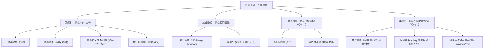

# 前缀和、线段树、树状数组 — 区间查询与区间更新的三件套

> 本文档将「区间 / 子数组 / 子矩阵」类问题的三大经典工具——**前缀和（Prefix Sum）**、**差分数组（Difference Array）**、**树状数组（Fenwick / Binary Indexed Tree）**与**线段树（Segment Tree）**——按核心解题思维、代码模板与应用场景进行深度浓缩。核心问题只有一个：**在区间上快速做「查询」与「更新」**，三件套是复杂度从 $O(n)$ 优化到 $O(1)$ / $O(\log n)$ 的完整递进。

---

## 目录
1. [知识点全景图与考点矩阵](#1-知识点全景图与考点矩阵)
2. [思维范式一：前缀和（静态区间查询 O(1)）](#2-思维范式一前缀和静态区间查询-o1)
3. [思维范式二：差分数组（区间增量更新）](#3-思维范式二差分数组区间增量更新)
4. [思维范式三：树状数组 BIT（单点更新 + 前缀查询）](#4-思维范式三树状数组-bit单点更新--前缀查询)
5. [思维范式四：线段树（区间更新 + 区间查询）](#5-思维范式四线段树区间更新--区间查询)
6. [选型对比：四件工具怎么选](#6-选型对比四件工具怎么选)
7. [高频避坑与边界清单 (Gotchas)](#7-高频避坑与边界清单-gotchas)

---

## 1. 知识点全景图与考点矩阵



### 核心考点与经典题目对照

| 知识范式 | 核心思想 | 经典题目来源 |
| :--- | :--- | :--- |
| **一维前缀和** | `pre[i+1] = pre[i] + nums[i]`，区间和 = 两个前缀相减 | 区域和检索 (303)、寻找数组中心下标 (724) |
| **二维前缀和** | 容斥原理 `S = a + b - c + d` 构造与查询 | 二维区域和检索 (304) |
| **前缀和 + 哈希计数** | 区间和问题转「两前缀差 == k」计数 | 和为 K 的子数组 (560)、和可被 K 整除 (523)、连续数组 (525) |
| **树上前缀和（回溯）** | 路径前缀和表 + 回溯撤销，维护单一路径 | 路径总和 III (437) |
| **差分数组** | 区间增量只改两端（`+d` 与 `-d`），前缀和还原 | 区间加法 (370)、航班预订统计 (1109) |
| **树状数组 BIT** | 单点更新 + 前缀查询 $O(\log n)$，`lowbit` 索引 | 区域和检索-可变 (307)、右侧更小的数 (315) |
| **BIT 逆序对** | 离散化 + 从右向左插入，查询已插入的更小数 | 计算右侧小于当前元素的个数 (315)、翻转对 (493) |
| **线段树** | 分治建树，节点存区间聚合值；区间更新配 lazy | 区域和检索-可变 (307)、我的日程表 III (732)、天际线 (218) |

---

## 2. 思维范式一：前缀和（静态区间查询 O(1)）

### 核心心智模型
- **特征**：数组**只读不改**，反复询问任意区间 `[i, j]` 的和 / 积。
- **一句话**：预处理前缀和数组，让「任意区间和」从每次扫描 $O(n)$ 降到 $O(1)$。
- **公式**：`pre[i+1] = pre[i] + nums[i]`，则 `sum(i..j) = pre[j+1] - pre[i]`。
- **前缀和经典变体**：把区间问题翻译成「两个前缀的差满足某条件」，配合哈希表做 $O(n)$ 计数。

### 1. 一维前缀和（Range Sum Query - Immutable - 303）

```go
type NumArray struct {
    pre []int // pre[i] = nums[0..i-1] 之和，长度 n+1
}

func Constructor(nums []int) NumArray {
    pre := make([]int, len(nums)+1)
    for i, v := range nums {
        pre[i+1] = pre[i] + v
    }
    return NumArray{pre: pre}
}

// 区间 [i, j] 的和
func (a NumArray) SumRange(i, j int) int {
    return a.pre[j+1] - a.pre[i]
}
```

- **复杂度**：预处理 $O(n)$，每次查询 $O(1)$。
- **技巧**：`pre` 开 `n+1` 长度且 `pre[0]=0`，让区间 `[0, j]` 也能套同一公式，免去边界特判。

### 2. 二维前缀和（Range Sum Query 2D - Immutable - 304）

- **构造**：`pre[i+1][j+1]` 表示左上角 `(0,0)` 到 `(i,j)` 的矩形和，用容斥合并：`S = 上 + 左 - 左上对角 + 自身`。
- **查询**：子矩形 `[r1..r2][c1..c2]` 同样四次容斥：`大矩形 - 上 - 左 + 左上`。

```go
type NumMatrix struct {
    pre [][]int
}

func Constructor(matrix [][]int) NumMatrix {
    m, n := len(matrix), len(matrix[0])
    pre := make([][]int, m+1)
    for i := range pre {
        pre[i] = make([]int, n+1)
    }
    for i := 0; i < m; i++ {
        for j := 0; j < n; j++ {
            pre[i+1][j+1] = pre[i][j+1] + pre[i+1][j] - pre[i][j] + matrix[i][j]
        }
    }
    return NumMatrix{pre: pre}
}

func (m NumMatrix) SumRegion(r1, c1, r2, c2 int) int {
    p := m.pre
    return p[r2+1][c2+1] - p[r1][c2+1] - p[r2+1][c1] + p[r1][c1]
}
```

### 3. 前缀和 + 哈希表计数（Subarray Sum Equals K - 560）

- **关键转化**：子数组 `nums[i..j]` 和为 `k` ⟺ `pre[j+1] - pre[i] == k` ⟺ 存在前缀和 `pre[i] == pre[j+1] - k`。
- **算法**：从左到右维护「当前前缀和」，用哈希表统计**之前出现过**的前缀和次数，`count += cnt[sum-k]`，再登记当前前缀和。
- **⚠️ 顺序**：必须先查表再加当前前缀，否则会数进「自己」甚至出现负贡献；初始 `{0:1}` 代表「空前缀」，用来统计从下标 0 开始的子数组。

```go
func subarraySum(nums []int, k int) int {
    count, sum := 0, 0
    cnt := map[int]int{0: 1}
    for _, v := range nums {
        sum += v
        count += cnt[sum-k] // 之前有多少个前缀和等于 sum-k
        cnt[sum]++
    }
    return count
}
```

- 同套路变体：**和可被 K 整除的子数组 (523)** 存前缀和模 K 的余数；**连续数组 (525)** 把 0 看作 -1，求「前缀和相等」的最长距离。

### 4. 树上前缀和 + 回溯（Path Sum III - 437）

- 在二叉树 DFS 过程中维护**当前路径**上的前缀和表；回溯出子树时删除当前节点的贡献，保证表里只有当前路径。

```go
func pathSum(root *TreeNode, targetSum int) int {
    cnt := map[int]int{0: 1} // 当前路径上前缀和 -> 次数
    var dfs func(*TreeNode, int) int
    dfs = func(node *TreeNode, sum int) int {
        if node == nil {
            return 0
        }
        sum += node.Val
        res := cnt[sum-targetSum] // 当前路径上存在起点，使路径和为 targetSum
        cnt[sum]++
        res += dfs(node.Left, sum) + dfs(node.Right, sum)
        cnt[sum]-- // 回溯撤销，保持只统计当前路径
        return res
    }
    return dfs(root, 0)
}
```

---

## 3. 思维范式二：差分数组（区间增量更新）

### 核心心智模型
- **特征**：对数组进行**多次区间整体加 / 减**，最终一次性求结果数组。
- **核心思想**：区间 `[i, j]` 加 `d`，不必逐个元素改，只改**差分数组两端**：`diff[i] += d`、`diff[j+1] -= d`，最后做一遍前缀和还原。
- **本质**：差分数组是前缀和的逆运算——前缀和「由前缀还原元素」，差分「由端点还原区间」。

```go
// 区间加法（Range Addition - 370）
func getModifiedArray(n int, updates [][]int) []int {
    diff := make([]int, n)
    for _, u := range updates {
        i, j, d := u[0], u[1], u[2]
        diff[i] += d
        if j+1 < n {
            diff[j+1] -= d // 越界则跳过
        }
    }
    res := make([]int, n)
    res[0] = diff[0]
    for i := 1; i < n; i++ {
        res[i] = res[i-1] + diff[i] // 前缀和还原
    }
    return res
}
```

- **复杂度**：$O(n + m)$（$m$ 为区间操作数），比每区间暴力 $O(n)$ 快一个数量级。
- **变体**：二维差分（矩形区域加值）同理，在四角打标记；常见于「矩阵多次区域增量」与「航班预订统计 (1109)」。
- **注意**：差分适合**只关心最终数组**的场景；如果过程中也要查询中间状态的区间和，请改用 BIT / 线段树。

---

## 4. 思维范式三：树状数组 BIT（单点更新 + 前缀查询）

### 核心心智模型
- **特征**：数组**动态变化**（单点改值 / 单点加值），还要快速回答前缀和 / 区间和。
- **核心思想**：用 `lowbit` 把前缀拆成 $O(\log n)$ 段，每个「管理段」用一个节点累加，实现：
  - 单点更新：从该点向上爬，逐段加 delta —— `i += i & -i`
  - 前缀查询：从该点向下拆，逐段求和 —— `i -= i & -i`
- **为什么快**：树状数组用 $O(n)$ 空间换 $O(\log n)$ 的单点更新与前缀查询，且常数极小、代码极短。

### 1. BIT 模板

```go
type Fenwick struct {
    tree []int // 1 基下标；tree[i] 管理 (i-lowbit(i)+1)..i 的和
}

func (f *Fenwick) add(i, delta int) {
    for i < len(f.tree) {
        f.tree[i] += delta
        i += i & -i
    }
}

func (f *Fenwick) prefixSum(i int) int { // 前 i 项和（1 基）
    s := 0
    for i > 0 {
        s += f.tree[i]
        i -= i & -i
    }
    return s
}

func (f *Fenwick) rangeSum(l, r int) int { // 区间 [l, r] 和（1 基）
    return f.prefixSum(r) - f.prefixSum(l-1)
}
```

### 2. 动态区间和（Range Sum Query - Mutable - 307）

```go
type NumArray struct {
    nums []int
    bit  *Fenwick
}

// update(i, val)：算出增量，BIT 单点加，并同步 nums
func (a *NumArray) Update(i, val int) {
    delta := val - a.nums[i]
    a.nums[i] = val
    a.bit.add(i+1, delta) // 0 基转 1 基
}

func (a *NumArray) SumRange(i, j int) int {
    return a.bit.rangeSum(i+1, j+1)
}
```

### 3. 逆序对 / 右侧更小数计数（Count of Smaller Numbers After Self - 315）

- **离散化**：值域可能很大（甚至负数），先把所有值排序、映射为 `1..n` 的排名。
- **从右向左扫描**：`rank(v)` 表示 `v` 的排名；「已插入且排名更小」的个数即 `prefixSum(rank-1)`，查询后把当前元素插入 BIT。

```go
func countSmaller(nums []int) []int {
    sorted := append([]int(nil), nums...)
    sort.Ints(sorted)
    rank := func(v int) int {
        return sort.SearchInts(sorted, v) + 1 // 1 基排名
    }
    bit := &Fenwick{tree: make([]int, len(nums)+2)}
    res := make([]int, len(nums))
    for i := len(nums) - 1; i >= 0; i-- {
        r := rank(nums[i])
        res[i] = bit.prefixSum(r - 1) // 左侧已经插入的、比它小的个数
        bit.add(r, 1)
    }
    return res
}
```

- 同类应用：**翻转对 (493)** 需要维护「值 ≥ 2×v」的计数，同样先离散化再二分定位；BIT 是计数类问题的利器（值作下标、频次作权值）。

---

## 5. 思维范式四：线段树（区间更新 + 区间查询）

### 核心心智模型
- **特征**：需要**同时支持动态单点 / 区间更新与区间查询**，且聚合信息不限于和（max / min / gcd / 区间和均可用）。
- **核心思想**：把整个区间递归二分建树，每个节点存「该区间的聚合值」；查询 / 更新时按需访问 $O(\log n)$ 个节点。
- **与 BIT 的关系**：线段树是 BIT 的超集——BIT 只能做「单点更新 + 前缀查询」，线段树能做任意「区间更新 + 区间查询」，代价是 4 倍空间与稍大的常数。

### 1. 单点更新 + 区间查询模板（求和版）

```go
// tree[node] 维护区间 [l, r] 的和；node 从 1 开始，左右孩子 2*node / 2*node+1
type SegTree struct {
    tree []int // 开 4*n 空间
}

func build(tree []int, nums []int, node, l, r int) int {
    if l == r {
        tree[node] = nums[l]
        return tree[node]
    }
    mid := (l + r) / 2
    tree[node] = build(tree, nums, node*2, l, mid) + build(tree, nums, node*2+1, mid+1, r)
    return tree[node]
}

// 把下标 idx 的值改为 val
func update(tree []int, node, l, r, idx, val int) {
    if l == r {
        tree[node] = val
        return
    }
    mid := (l + r) / 2
    if idx <= mid {
        update(tree, node*2, l, mid, idx, val)
    } else {
        update(tree, node*2+1, mid+1, r, idx, val)
    }
    tree[node] = tree[node*2] + tree[node*2+1] // 回溯合并
}

// 查询区间 [ql, qr] 的和
func query(tree []int, node, l, r, ql, qr int) int {
    if ql <= l && r <= qr { // 当前节点区间被完全覆盖
        return tree[node]
    }
    mid := (l + r) / 2
    res := 0
    if ql <= mid {
        res += query(tree, node*2, l, mid, ql, qr)
    }
    if qr > mid {
        res += query(tree, node*2+1, mid+1, r, ql, qr)
    }
    return res
}
```

### 2. 区间更新 + lazy 延迟标记

- **问题**：区间加 `[ql, qr]` 时，若逐叶更新最坏 $O(n)$。
- **Lazy 思想**：某节点区间被**完全覆盖**时，不再下钻，只改该节点聚合值并打上「待下传」标记；**下次必须下钻**（查询/更新子区间）时才把标记下推给两个孩子。保证每个操作仍为 $O(\log n)$。

```go
// 区间 [ql, qr] 全部加 val；lazy 数组存待下传的增量
func updateRange(tree, lazy []int, node, l, r, ql, qr, val int) {
    if ql <= l && r <= qr {
        tree[node] += (r - l + 1) * val
        lazy[node] += val
        return
    }
    pushDown(tree, lazy, node, l, r)
    mid := (l + r) / 2
    if ql <= mid {
        updateRange(tree, lazy, node*2, l, mid, ql, qr, val)
    }
    if qr > mid {
        updateRange(tree, lazy, node*2+1, mid+1, r, ql, qr, val)
    }
    tree[node] = tree[node*2] + tree[node*2+1]
}

func pushDown(tree, lazy []int, node, l, r int) {
    if lazy[node] == 0 {
        return
    }
    mid := (l + r) / 2
    tree[node*2] += (mid - l + 1) * lazy[node]
    lazy[node*2] += lazy[node]
    tree[node*2+1] += (r - mid) * lazy[node]
    lazy[node*2+1] += lazy[node]
    lazy[node] = 0
}
```

- 区间查询同样要**先 pushDown 再递归**，否则读到的是未下传的旧值。
- **典型应用**：我的日程表 III (732)（区间 +1 后取全局最大值）、天际线问题 (218)（区间最大值 + 线段树离散化）、墙与门等。

---

## 6. 选型对比：四件工具怎么选

| 工具 | 支持单点更新 | 支持区间更新 | 支持区间查询 | 时间复杂度 | 适用场景 |
| :--- | :---: | :---: | :---: | :--- | :--- |
| **前缀和** | ✗ | ✗ | ✔（静态） | 预处理 $O(n)$，查询 $O(1)$ | 数组不变，反复问区间和；配合哈希做子数组计数 |
| **差分数组** | ✗ | ✔（打标） | ✗（需 $O(n)$ 还原） | 更新 $O(1)$，还原 $O(n)$ | 多次区间加值后求最终数组 |
| **树状数组 BIT** | ✔ $O(\log n)$ | 差分技巧 $O(\log n)$ | 前缀/区间 $O(\log n)$ | 空间 $O(n)$ | 单点更新 + 前缀查询；逆序对等计数类问题 |
| **线段树** | ✔ $O(\log n)$ | ✔ $O(\log n)$（lazy） | ✔ $O(\log n)$ | 空间 $4n$ | 信息可合并（sum/max/min/gcd）且需区间更新 |

> **决策口诀**：
> - 只读 + 区间查询 → **前缀和**
> - 只写（区间批量加）+ 最后看结果 → **差分数组**
> - 读改写混合但只需前缀 → **树状数组**（代码最简）
> - 读改写混合 + 任意区间 + 信息复杂 → **线段树**（功能最全）

---

## 7. 高频避坑与边界清单 (Gotchas)

1. **前缀和数组长度 +1**：`pre[0]=0`，区间 `[i,j]` 用 `pre[j+1]-pre[i]`，避免对 `i=0` 特判；二维前缀和同理开 `(m+1)×(n+1)`。
2. **二维容斥别漏项**：构造 `S=上+左-左上对角+自身`（减一次对角），查询 `大-上-左+左上`（加回被多减的对角），两个容斥都要到位。
3. **前缀和 + 哈希的顺序**：**先 `count += cnt[sum-k]` 再 `cnt[sum]++`**；反过来会把当前这个前缀自己数进去。初始 `cnt[0]=1` 必不可少。
4. **差分端点别越界**：区间 `[i,j]` 更新后要在 `j+1` 处 `-delta`，但仅当 `j+1 < n`；还原时从头累加 `res[i] = res[i-1] + diff[i]`。
5. **BIT 一律 1 基下标**：输入是 0 基要先 `+1`；`lowbit(i) = i & -i`；`add` 向上走（`i += lowbit`）、`prefixSum` 向下走（`i -= lowbit`）。
6. **BIT 求逆序对必须先离散化**：值域大或有负数时不能直接当下标；排序 + `sort.SearchInts` 求 1 基排名，再从右向左插入查询。
7. **线段树空间开 4n**：递归建树以 `l == r` 为叶子终止；`node` 从 1 开始，左右孩子 `2*node / 2*node+1`。
8. **区间更新必须配 lazy，且下钻前必 pushDown**：不 pushDown 会读到未下传的旧值；pushDown 要把增量按子区间长度拆给两个孩子再清零。
9. **BIT 与线段树的边界认知**：BIT 做不了「任意区间更新 + 任意区间查询」的原始语义（区间更新需差分技巧且只支持前缀类信息）；需要区间 max/min/gcd 请直接上线段树。
10. **超大规模离散化**：线段树维护大值域（如坐标 1e9）时先离散化再建树，或改用动态开点；别把 4n 误解为可以存下原始坐标。
11. **溢出**：前缀和 / 差分 / BIT 累加结果可能超过 `int32`，Go 里用 `int`（64 位平台安全），C++ 用 `long long`。

## 本地练习入口

- 仓库已有实现：`leetcode/range-addition.go`（差分数组模板，含单测）、`algorithms/paradigms/prefix-sum/path_sum_iii.go`（树上前缀和 + 回溯）。
- 基础概念参考：`algorithms/paradigms/README.md`（前缀与差分）、`algorithms/data-structures/README.md`（线段树 / 树状数组在树与堆专题下的索引）。
