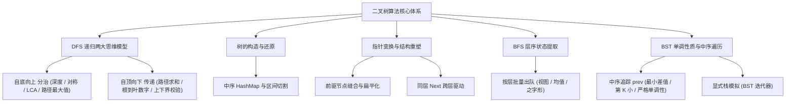

# Binary Tree & BST — 二叉树与搜索树核心解题方法论

> 本文档将 LeetCode 经典高频树题目（Top Interview 150 树专题）按**核心解题思维、递归模式与算法知识点**进行深度浓缩与归纳，告别题海战术，掌握二叉树的本质解题范式。

---

## 目录
1. [知识点全景图与考点矩阵](#1-知识点全景图与考点矩阵)
2. [思维范式一：自底向上（分治 / 后序遍历 / 结果汇总）](#2-思维范式一自底向上分治--后序遍历--结果汇总)
3. [思维范式二：自顶向下（前序遍历 / 上下文与约束传递）](#3-思维范式二自顶向下前序遍历--上下文与约束传递)
4. [思维范式三：树的构造与区间划分（Pre/In/Postorder）](#4-思维范式三树的构造与区间划分preinpostorder)
5. [思维范式四：指针就地变形与树结构扁平化](#5-思维范式四指针就地变形与树结构扁平化)
6. [思维范式五：广度优先与层序状态管理 (BFS)](#6-思维范式五广度优先与层序状态管理-bfs)
7. [思维范式六：二叉搜索树（BST）与中序单调性](#7-思维范式六二叉搜索树bst与中序单调性)
8. [思维范式七：完全二叉树的二分剪枝思想](#8-思维范式七完全二叉树的二分剪枝思想)
9. [二叉树高频避坑与边界清单 (Gotchas)](#9-二叉树高频避坑与边界清单-gotchas)

---

## 1. 知识点全景图与考点矩阵



### 核心考点与经典题目对照

| 知识范式 | 核心思想 | 经典题目来源 |
| :--- | :--- | :--- |
| **自底向上 (Bottom-Up)** | 子树向父节点返回信息，在父节点合并 | 最大深度 (104)、相同的树 (100)、翻转树 (226)、对称树 (101)、二叉树最大路径和 (124)、最近公共祖先 LCA (236) |
| **自顶向下 (Top-Down)** | 父节点向子树传递累积值/边界约束 | 路径总和 (112)、求根节点到叶节点数字之和 (129)、验证二叉搜索树 (98) |
| **结构还原 (Reconstruction)** | 根定位 + 中序划分子树区间 | 前序+中序构造树 (105)、中序+后序构造树 (106) |
| **就地变形 (In-Place Mutation)** | 指针缝合、前驱探测、消除递归空间 | 二叉树展开为链表 (114)、填充每个节点的下一个右侧节点指针 II (117) |
| **层序状态 (BFS Batching)** | 队列大小锁定当前层，状态批量计算 | 层序遍历 (102)、二叉树的右视图 (199)、层平均值 (637)、锯齿形层序遍历 (103) |
| **BST 中序单调性** | 中序遍历严格递增，维护 `prev` 前驱指针 | 验证 BST (98)、BST 最小绝对差 (530)、BST 中第 K 小的元素 (230)、BST 迭代器 (173) |
| **树上二分 (Tree Binary Search)** | 利用树的形状特性剪枝，降低复杂度 | 完全二叉树的节点个数 (222) |

---

## 2. 思维范式一：自底向上（分治 / 后序遍历 / 结果汇总）

### 核心心智模型
- **特征**：父节点需要依赖左右子树的计算结果，才能算出当前节点的答案。
- **模板结构**：
  ```text
  1. Base Case: root == nil 时返回默认值（0, true, nil 等）。
  2. 递归获取左子树结果 leftResult = dfs(root.Left)。
  3. 递归获取右子树结果 rightResult = dfs(root.Right)。
  4. 将 leftResult、rightResult 与当前 root.Val 结合，汇总并向上返回。
  ```

### 经典应用模式

#### 1. 结构与对称性校验（双树/左右树比对）
- **核心逻辑**：比较两个节点 $A$ 和 $B$ 是否满足条件，再递归比对它们的子节点。
- **对称树 (101) 判定**：比较 $A.\text{val} == B.\text{val}$ 且 `check(A.left, B.right)` 且 `check(A.right, B.left)`。
- **相同的树 (100) 判定**：比较 $A.\text{val} == B.\text{val}$ 且 `check(A.left, B.left)` 且 `check(A.right, B.right)`。

#### 2. 最近公共祖先（Lowest Common Ancestor, LCA - 236）
- **返回值定义**：如果以当前节点为根的子树中包含 $p$ 或 $q$，则返回对应节点指针；若都不包含，返回 `nil`。
- **合并规则**：
  ```go
  if root == nil || root == p || root == q {
      return root
  }
  left := lowestCommonAncestor(root.Left, p, q)
  right := lowestCommonAncestor(root.Right, p, q)
  if left != nil && right != nil {
      return root // p 和 q 分别位于左右两侧，当前节点即为 LCA; 另一种情况p/q为父子关系则答案恰好由父来确定
  }
  if left != nil {
      return left
  }
  return right
  ```

#### 3. 树形 DP：全局最优与子树贡献分离（最大路径和 - 124）
- **关键矛盾**：**“能够向上贡献给父节点的单边最大路径”** vs **“以当前节点为拐点的全局最大路径和”** 是两个不同概念。
- **解法**：递归函数返回**单边最大收益**，同时在递归过程中用**双边路径和**更新全局最大值：
  ```go
  func maxGain(node *TreeNode, maxSum *int) int {
      if node == nil { return 0 }
      // 只有贡献为正数时才采纳
      left := max(0, maxGain(node.Left, maxSum))
      right := max(0, maxGain(node.Right, maxSum))
      
      // 更新以当前节点为拐点的全局最大路径
      *maxSum = max(*maxSum, node.Val + left + right)
      
      // 向父节点只能贡献单边最大分支
      return node.Val + max(left, right)
  }
  ```

---

## 3. 思维范式二：自顶向下（前序遍历 / 上下文与约束传递）

### 核心心智模型
- **特征**：计算当前节点时，需要父辈节点传递下来的“历史累计值”或“合法值范围约束”。
- **模板结构**：
  ```text
  func dfs(node *TreeNode, currentContext Context) {
      if node == nil { return }
      // 1. 根据父辈 context 与当前 node 计算新状态
      newContext = update(currentContext, node.Val)
      // 2. 若是叶子节点，触发统计或判定
      if isLeaf(node) { record(newContext); return }
      // 3. 向下传递状态
      dfs(node.Left, newContext)
      dfs(node.Right, newContext)
  }
  ```

### 经典应用模式

#### 1. 路径和统计（Path Sum 112 & Sum Root to Leaf Numbers 129）
- **Path Sum (112)**：向下传递 `targetSum - node.Val`，叶子节点判断是否等于当前节点值。
- **Sum Root to Leaf (129)**：每深入一层，当前数值变为 `curVal * 10 + node.Val`，到叶子节点累加进总和。

#### 2. 上下界边界传递（Validate BST - 98）
- 树的每个节点必须满足：`lowerBound < node.Val < upperBound`。
- 进入左子树时更新上限：`upperBound = node.Val`；进入右子树时更新下限：`lowerBound = node.Val`。
- **注意**：初始边界必须设置为 `(-∞, +∞)`，且需防范 `int` 越界（使用 `long` 或 `*int` 指针作为边界哨兵）。

---

## 4. 思维范式三：树的构造与区间划分（Pre/In/Postorder）

### 核心心智模型
- **二叉树序列的决定性特征**：
  - **前序 (Preorder)**：`[ 根节点 | --- 左子树 --- | --- 右子树 --- ]`（首元素即为根）
  - **后序 (Postorder)**：`[ --- 左子树 --- | --- 右子树 --- | 根节点 ]`（尾元素即为根）
  - **中序 (Inorder)**：`[ --- 左子树 --- | 根节点 | --- 右子树 --- ]`（根将左右子树彻底分开）
- **构造三步法**：
  1. 通过前序首元素（或后序末元素）确定当前子树的 `rootVal`。
  2. 在中序序列中找到 `rootVal` 所在索引 `idx`（使用预先构建的 HashMap 实现 $O(1)$ 定位）。
  3. 计算左子树长度 `leftLen = idx - inStart`，精确计算左右子树在前序/后序中的索引区间，递归构建。


```go
// 前序 + 中序 核心构建模板
func build(preorder []int, preL, preR int, inorder []int, inL, inR int, inMap map[int]int) *TreeNode {
    if preL > preR { return nil }
    
    rootVal := preorder[preL]
    idx := inMap[rootVal]
    leftLen := idx - inL
    
    root := &TreeNode{Val: rootVal}
    root.Left = build(preorder, preL+1, preL+leftLen, inorder, inL, idx-1, inMap)
    root.Right = build(preorder, preL+leftLen+1, preR, inorder, idx+1, inR, inMap)
    return root
}
```

---

## 5. 思维范式四：指针就地变形与树结构扁平化

### 1. 二叉树展开为单链表（Flatten Binary Tree - 114）
- **目标**：按照前序遍历顺序，将树原地改成仅有 `Right` 指针的链表。
- **最优解法（寻找前驱节点 / $O(1)$ 空间）**：
  - 如果当前节点 `curr` 有左子树，找到左子树中**最右边的节点（前驱节点 `predecessor`）**。
  - 将 `curr.Right` 整个嫁接到 `predecessor.Right`。
  - 将 `curr.Left` 挪到 `curr.Right`，并将 `curr.Left` 置空。
  - `curr = curr.Right`，继续向下处理。

### 2. 跨层 Next 指针连接（Populating Next Right Pointers II - 117）
- **挑战**：在非完美二叉树中，要求额外空间复杂度为 $O(1)$。
- **解法（利用上一层已建立的 Next 链表作为迭代驱动）**：
  - 使用一个 `dummy` 虚拟头节点记录下一层链表的起始位置。
  - 维护一个 `tail` 指针在下一层逐步串联当前节点子节点：
  ```go
  for curLevelNode != nil {
      if curLevelNode.Left != nil {
          tail.Next = curLevelNode.Left
          tail = tail.Next
      }
      if curLevelNode.Right != nil {
          tail.Next = curLevelNode.Right
          tail = tail.Next
      }
      curLevelNode = curLevelNode.Next // 横向沿上一层的 next 滑动
  }
  ```

---

## 6. 思维范式五：广度优先与层序状态管理 (BFS)

### 核心心智模型
- **层级隔离机制**：进入外层循环时，当前队列中的元素个数 `size := len(queue)` **精确等于该层的全部节点数**。
- **固定模式**：
  ```go
  queue := []*TreeNode{root}
  for len(queue) > 0 {
      levelSize := len(queue)
      // 处理当前层所有节点
      for i := 0; i < levelSize; i++ {
          node := queue[0]
          queue = queue[1:]
          
          // 业务逻辑（如记录右视图、求层平均值）
          if i == levelSize - 1 { recordRightView(node.Val) }
          
          if node.Left != nil { queue = append(queue, node.Left) }
          if node.Right != nil { queue = append(queue, node.Right) }
      }
  }
  ```

### 衍生技巧
1. **右视图 (199)**：取每层最后一个出队元素（`i == levelSize - 1`）。
2. **锯齿形 / 之字形遍历 (103)**：
   - 维护一个 `isOddLevel` 标记。
   - 每层的临时数组通过根据标记选择**正向追加**或**反向插入 / 双端队列**实现。

---

## 7. 思维范式六：二叉搜索树（BST）与中序单调性

### 核心定理
> **二叉搜索树的“中序遍历”序列严格单调递增。**  
> 所有关于 BST 的有序性问题（查找、验证、第 K 小、最小绝对差），本质上都可以**退化为对有序数组的滑动窗口或前后双指针操作**。

### 1. 中序遍历 + 前驱追踪（Prev Pointer Track）
- 在中序递归或迭代过程中，维护一个全局或引用的 `prev *TreeNode` 指针，实时与当前 `node` 比对：
  - **验证 BST (98)**：断言 `prev == nil || prev.Val < node.Val`。
  - **最小绝对差 (530)**：`minDiff = min(minDiff, node.Val - prev.Val)`。
  - **第 K 小的元素 (230)**：中序访问计数 `k--`，当 `k == 0` 时直接捕获当前 `node.Val` 并提前终止。

### 2. 显式栈与受控中序迭代器（BST Iterator - 173）
- **核心思想**：不一次性遍历整棵树（避免 $O(n)$ 内存），而是使用栈**惰性加载**：
  - 初始化时，将根节点及其所有左侧祖先依次压栈（栈顶即为全局最小值）。
  - 调用 `Next()` 时，弹出栈顶节点 `node`，并将 `node.Right` 及其所有左子节点压栈。
  - **复杂度**：空间复杂度严格为 $O(h)$（$h$ 为树高），`Next()` 均摊时间复杂度为 $O(1)$。

```go
type BSTIterator struct {
    stack []*TreeNode
}

func Constructor(root *TreeNode) BSTIterator {
    it := BSTIterator{}
    it.pushAllLeft(root)
    return it
}

func (it *BSTIterator) pushAllLeft(node *TreeNode) {
    for node != nil {
        it.stack = append(it.stack, node)
        node = node.Left
    }
}

func (it *BSTIterator) Next() int {
    top := it.stack[len(it.stack)-1]
    it.stack = it.stack[:len(it.stack)-1]
    it.pushAllLeft(top.Right)
    return top.Val
}

func (it *BSTIterator) HasNext() bool {
    return len(it.stack) > 0
}
```

---

## 8. 思维范式七：完全二叉树的二分剪枝思想

### 完全二叉树的节点个数（Count Complete Tree Nodes - 222）
- **平凡做法**：普通遍历 $O(n)$。
- **利用性质的 $O(\log^2 n)$ 剪枝做法**：
  - 分别计算当前根节点的**左子树最左深度 `leftDepth`** 和 **右子树最左深度 `rightDepth`**。
  - **情况 1: `leftDepth == rightDepth`**
    - 说明左子树是一棵**满二叉树**（节点数为 $2^{\text{leftDepth}} - 1$）。
    - 加上根节点后，左半部分共有 $2^{\text{leftDepth}}$ 个节点。
    - 递归计算右子树节点数即可：`return (1 << leftDepth) + countNodes(root.Right)`。
  - **情况 2: `leftDepth > rightDepth`**
    - 说明最后一层的缺失发生在左子树，此时**右子树是一棵满二叉树**（高度为 `rightDepth`）。
    - 右半部分加上根节点共有 $2^{\text{rightDepth}}$ 个节点。
    - 递归计算左子树节点数即可：`return (1 << rightDepth) + countNodes(root.Left)`。

---

## 9. 二叉树高频避坑与边界清单 (Gotchas)

1. **空树与单节点边界**：
   - 任何递归入口必须第一步处理 `if root == nil`。
   - 树的最大路径和（124）、直径等题目，如果节点值可能为负数，全局最大值初始值必须设为 `math.MinInt32` 或 `root.Val`，切忌设为 0。
2. **BST 上下界整型溢出**：
   - 节点值如果恰好是 `math.MaxInt32` 或 `math.MinInt32`，使用 `int` 范围极值比较会发生等号误判。应使用 `math.MinInt64` / `math.MaxInt64` 或指针哨兵。
3. **分治递归中全局变量的重置**：
   - 多用传参指针或闭包捕获局部变量，避免全局变量在并发/多次测试用例间状态污染。
4. **BFS 遍历必须先取 `levelSize`**：
   - 循环条件切勿写成 `for i := 0; i < len(queue); i++`，因为循环体内部 `queue` 会动态 `append`，导致层级边界失效。
